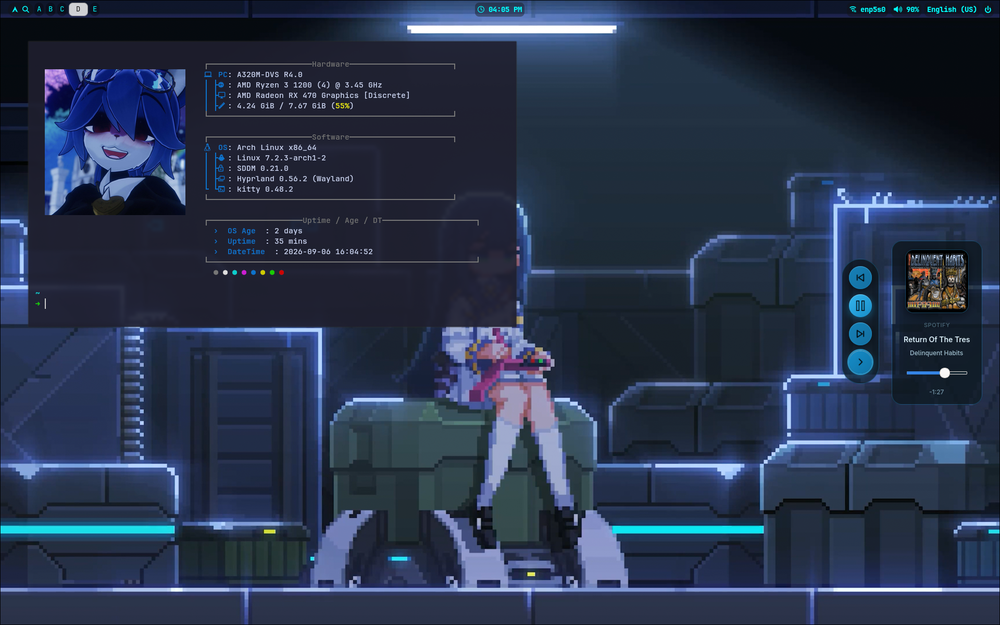

# dotfiles

> My daily driver. My configs. My questionable decisions.

A personal **Hyprland** setup built around a fast, minimal and heavily customized Wayland desktop.

No fancy installer. No magic script. Just configs and a fuckton of tweaking.

## What's inside

* **Hyprland** — compositor / WM
* **Waybar** — status bar
* **Hyprwave** — audio visualizer
* **Swww / Awww** — wallpapers
* **Fastfetch** — because `neofetch` wasn't enough

## Setup

```bash
git clone https://github.com/Fillos-A98/dotfiles.git
cd dotfiles
```

Then copy whatever you actually want from `config/`.

## Philosophy

Keep it fast.
Keep it clean.
Break it.
Fix it.
Commit it.

```text
Arch Linux
    ↓
Hyprland
    ↓
Waybar + Hyprwave
    ↓
way too much rice
```

## Screenshots



## License

Do whatever the fuck you want with it.
